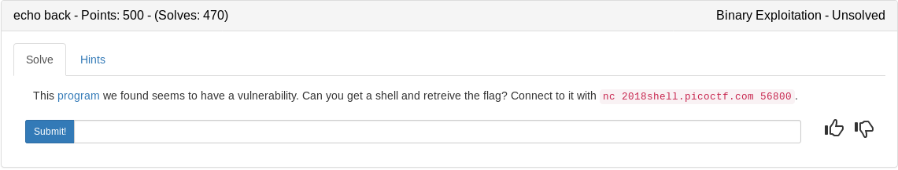
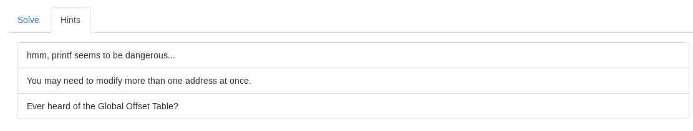

```
[*] '/root/ctf_writeups/pico2018/binary/echo_back/echoback'
    Arch:     i386-32-little
    RELRO:    Partial RELRO
    Stack:    Canary found
    NX:       NX enabled
    PIE:      No PIE (0x8048000)
~/ctf_writeups/pico2018/binary/echo_back# 
```

No source here so we'll mess around until we find a vulnerability. I decided to test a format string attack since the hint mentioned printf.

```
~/ctf_writeups/pico2018/binary/echo_back# ./echoback 
input your message:
%x
ffd8301c


Thanks for sending the message!
~/ctf_writeups/pico2018/binary/echo_back# 
```

So we can use this to leverage an attack, possibly overwriting an address on the global offset table to redirect code execution to either a win() type function or a shell