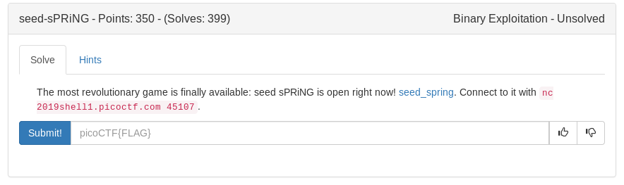

Exploring the binary we can see that it uses rand() with a 0xf offset (15) in order to produce random heights. We can attempt to replicate the random seed generation with a python module ctypes

Our strategy is to loop a bunch of times trying different random seeds and when level 1 succeeds the rest should as well

<details>
	<summary>exploit</summary>

```python
#!/usr/bin/env python

from pwn import *
import sys
import ctypes

argv = sys.argv
LIBC = ctypes.cdll.LoadLibrary('/lib/x86_64-linux-gnu/libc.so.6')

for i in range(100):
	if len(argv)>1:
		p = remote('2019shell1.picoctf.com', 45107)
	else:
		p = process('./seed_spring')

	try: 
		LIBC.srand(LIBC.time(0)-i)
		for j in range(30):
			p.sendlineafter('height:', str(LIBC.rand() & 0xf))
		p.interactive()
	except:
		pass


```
</details>

<details>
	<summary>Flag</summary>

picoCTF{pseudo_random_number_generator_not_so_random_829c50d19ba2bdb441975c0dabfcc1c0}
</details>