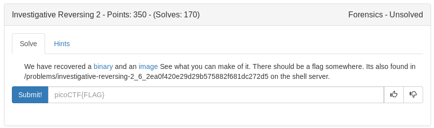
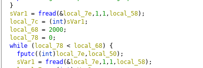

Looks like more reversing we can do here with encoded.bmp and mystery as our clues.
Loading the binary "mystery" into ghidra we get our first clue as a hard coded variable 
local 68 = 2000 which is likely where the changes begin



Reading the source it shows that original.bmp is loaded into encoded.bmp for the first 2000 bytes

then it checks to see if the flag is 50 characters

After that we work through the encoding from the 
```
original.bmp[2000:2000+(50*8))]
```

Python script below

<details>
	<summary>apple.py</summary>

```python
#!/usr/bin/env python

with open('./encoded.bmp', 'rb') as f:
	data = f.read()

offset = 2000
data = data[offset:offset+(50*8)]

flag = ''

for i in range(0x32):
	j = 0
	for k in range(8):
		j = j | (ord(data[i*8+(7-k)])&1)
		j = j << 1
	j = j >> 1
	flag += chr(j+5)
print flag
```
Source: https://tcode2k16.github.io/blog/posts/picoctf-2019-writeup/forensics/#investigative-reversing-2
</details>

<details>
	<summary>Flag</summary>

picoCTF{n3xt_0n300000000000000000000000006c732cee}
</details>