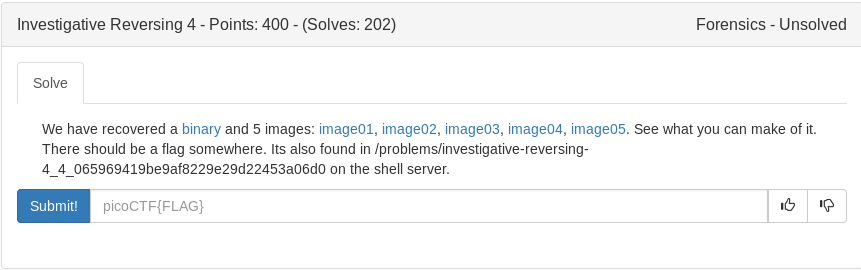

Similar to the previous ones we have a binary that is encoding data to an image. After exploring the binary i determined the first image Item01 was being used as the original image and the data is being encoded to Items2-5 starting at offset **0x7e3**

We can use the same script for Investigative Reversing 3, only chaging the offset and setting a for loop to run through all the bmps (except 01, the original).

```python3
#!/usr/bin/env python


flag = ''
def decode(file):
	a = ''
	with open('./'+file, 'rb') as f:
		f.seek(0x7e3)
		a = ''
		for i in range(0x32):
			if i % 5 == 0:
				b = ""
				for k in range(8):
					data = f.read(1)
					b += str(int.from_bytes(data, 'big') & 1)
				c = int(b[::-1], 2)
				a += chr(c)
			else:
				f.read(1)
		return a

for i in range(5):
	flag += decode('Item0'+str(5-i)+'_cp.bmp')
print (flag)
```

<details>
	<summary>Flag</summary>

picoCTF{N1c3_R3ver51ng_5k1115_000000000008d246eaf}
</details>