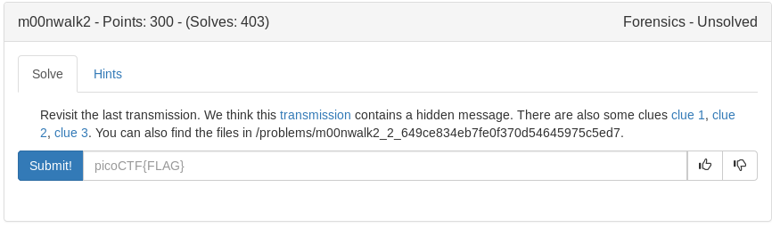

using SSTV again
Same .png as Moonwalk 1 and clue one shows up as a dinosaur (stegosaurus) hmmm steg...hide?

We use SSTV on the 3 clues and get information that leads us to run the following command

**steghide extract -SF message.wav**

password is in the stegosaurus picture (hidden_stegosaurus)

	
Flag

picoCTF{the_answer_lies_hidden_in_plain_sight}

