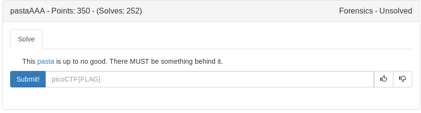

Based on the hint I assumed the flag was hidden on a plane within the image so I used stegsolve

**java -jar ~/stegsolve.jar**

Load the ctf.png and navigate to green plane1

	
Flag

picoCTF{pa$ta_1s_lyf3}

