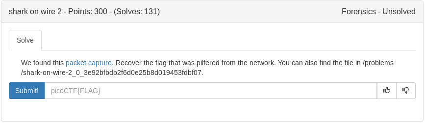
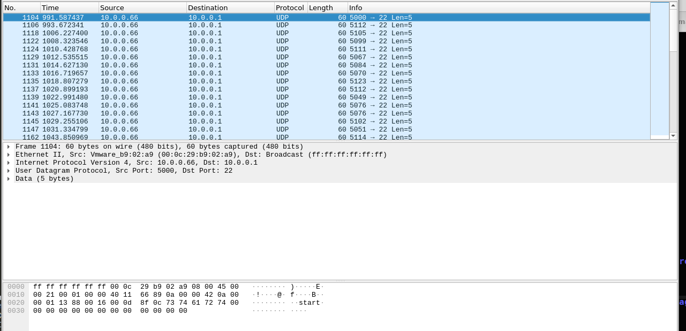

We have a pcap so lets explore with wireshark.

After lots of digging around there is a packet with the ascii start and another with end coming from the same source.

If we filter the source and udp we end up with the following



Lets export that as a new pcap then run the following command

```
tshark -r new.pcap -T fields -e frame.number -e ip.addr -e udp -e _ws.col.Info > output.txt
```

Now we can open in sublime text and single out some data using sublime magic

<details>
	<summary>output.txt</summary>

```
1	10.0.0.66,10.0.0.1	User Datagram Protocol, Src Port: 5000, Dst Port: 22	5000 → 22 Len=5
2	10.0.0.66,10.0.0.1	User Datagram Protocol, Src Port: 5112, Dst Port: 22	5112 → 22 Len=5
3	10.0.0.66,10.0.0.1	User Datagram Protocol, Src Port: 5105, Dst Port: 22	5105 → 22 Len=5
4	10.0.0.66,10.0.0.1	User Datagram Protocol, Src Port: 5099, Dst Port: 22	5099 → 22 Len=5
5	10.0.0.66,10.0.0.1	User Datagram Protocol, Src Port: 5111, Dst Port: 22	5111 → 22 Len=5
6	10.0.0.66,10.0.0.1	User Datagram Protocol, Src Port: 5067, Dst Port: 22	5067 → 22 Len=5
7	10.0.0.66,10.0.0.1	User Datagram Protocol, Src Port: 5084, Dst Port: 22	5084 → 22 Len=5
8	10.0.0.66,10.0.0.1	User Datagram Protocol, Src Port: 5070, Dst Port: 22	5070 → 22 Len=5
9	10.0.0.66,10.0.0.1	User Datagram Protocol, Src Port: 5123, Dst Port: 22	5123 → 22 Len=5
10	10.0.0.66,10.0.0.1	User Datagram Protocol, Src Port: 5112, Dst Port: 22	5112 → 22 Len=5
11	10.0.0.66,10.0.0.1	User Datagram Protocol, Src Port: 5049, Dst Port: 22	5049 → 22 Len=5
12	10.0.0.66,10.0.0.1	User Datagram Protocol, Src Port: 5076, Dst Port: 22	5076 → 22 Len=5
13	10.0.0.66,10.0.0.1	User Datagram Protocol, Src Port: 5076, Dst Port: 22	5076 → 22 Len=5
14	10.0.0.66,10.0.0.1	User Datagram Protocol, Src Port: 5102, Dst Port: 22	5102 → 22 Len=5
15	10.0.0.66,10.0.0.1	User Datagram Protocol, Src Port: 5051, Dst Port: 22	5051 → 22 Len=5
16	10.0.0.66,10.0.0.1	User Datagram Protocol, Src Port: 5114, Dst Port: 22	5114 → 22 Len=5
17	10.0.0.66,10.0.0.1	User Datagram Protocol, Src Port: 5051, Dst Port: 22	5051 → 22 Len=5
18	10.0.0.66,10.0.0.1	User Datagram Protocol, Src Port: 5100, Dst Port: 22	5100 → 22 Len=5
19	10.0.0.66,10.0.0.1	User Datagram Protocol, Src Port: 5095, Dst Port: 22	5095 → 22 Len=5
20	10.0.0.66,10.0.0.1	User Datagram Protocol, Src Port: 5100, Dst Port: 22	5100 → 22 Len=5
21	10.0.0.66,10.0.0.1	User Datagram Protocol, Src Port: 5097, Dst Port: 22	5097 → 22 Len=5
22	10.0.0.66,10.0.0.1	User Datagram Protocol, Src Port: 5116, Dst Port: 22	5116 → 22 Len=5
23	10.0.0.66,10.0.0.1	User Datagram Protocol, Src Port: 5097, Dst Port: 22	5097 → 22 Len=5
24	10.0.0.66,10.0.0.1	User Datagram Protocol, Src Port: 5095, Dst Port: 22	5095 → 22 Len=5
25	10.0.0.66,10.0.0.1	User Datagram Protocol, Src Port: 5118, Dst Port: 22	5118 → 22 Len=5
26	10.0.0.66,10.0.0.1	User Datagram Protocol, Src Port: 5049, Dst Port: 22	5049 → 22 Len=5
27	10.0.0.66,10.0.0.1	User Datagram Protocol, Src Port: 5097, Dst Port: 22	5097 → 22 Len=5
28	10.0.0.66,10.0.0.1	User Datagram Protocol, Src Port: 5095, Dst Port: 22	5095 → 22 Len=5
29	10.0.0.66,10.0.0.1	User Datagram Protocol, Src Port: 5115, Dst Port: 22	5115 → 22 Len=5
30	10.0.0.66,10.0.0.1	User Datagram Protocol, Src Port: 5116, Dst Port: 22	5116 → 22 Len=5
31	10.0.0.66,10.0.0.1	User Datagram Protocol, Src Port: 5051, Dst Port: 22	5051 → 22 Len=5
32	10.0.0.66,10.0.0.1	User Datagram Protocol, Src Port: 5103, Dst Port: 22	5103 → 22 Len=5
33	10.0.0.66,10.0.0.1	User Datagram Protocol, Src Port: 5048, Dst Port: 22	5048 → 22 Len=5
34	10.0.0.66,10.0.0.1	User Datagram Protocol, Src Port: 5125, Dst Port: 22	5125 → 22 Len=5
```
</details>

Looks like there is some decimal ascii in there so we single it out and we are left with

```
112
105
099
111
067
084
070
123
112
049
076
076
102
051
114
051
100
095
100
097
116
097
095
118
049
097
095
115
116
051
103
048
125
```

Put that into cyberchef and we get our flag

<details>
	<summary>Flag</summary>

picoCTF{p1LLf3r3d_data_v1a_st3g0}
</details>