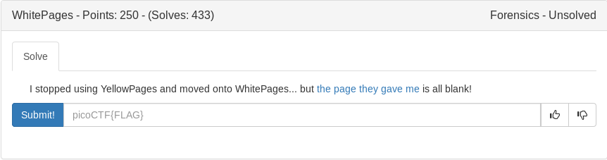

# Whitepages (Forensics)



```
file whitepages.txt
	whitepages.txt: UTF-8 Unicode text, with very long lines, with no line terminators
```

Got close to solving this one with messing around on cyberchef and I noticed if you changed the repeating hex e28083 with 0 and \x20 with 1 it created a flag but i could not get the formating right. Came back after the challenge and read some writeups that allowed python to do it for me

```python
#!/usr/bin/env python

from pwn import *

with open('./whitepages.txt', 'r') as f:
	file = f.read()

file = file.replace('\xe2\x80\x83', '0')
file = file.replace('\x20', '1')

print unbits(file)
```

<details>
	<summary>Flag</summary>

picoCTF{not_all_spaces_are_created_equal_f71be4d2457dc2d068e8b1e7a51ed39a}
</details>

[Credit](https://tcode2k16.github.io/blog/posts/picoctf-2019-writeup/forensics/#whitepages)