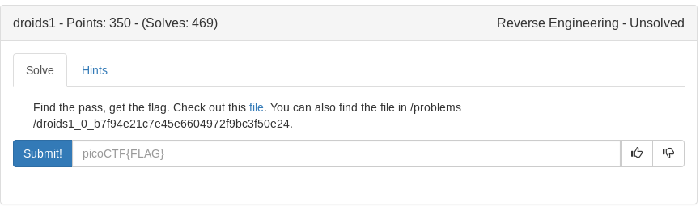
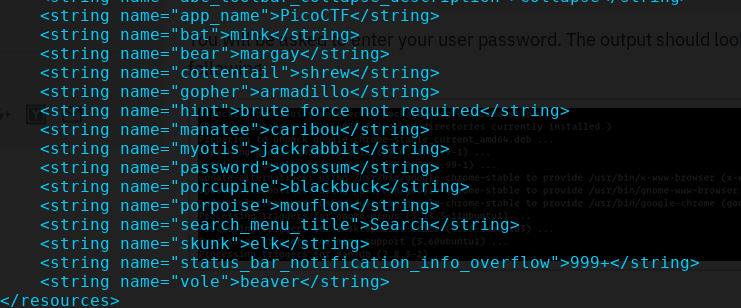

Hints suggest using apktool

**apktool d one.apk**

```
~/ctf_writeups/pico2019/re/droids1# apktool d one.apk 
I: Using Apktool 2.3.4-dirty on one.apk
I: Loading resource table...
I: Decoding AndroidManifest.xml with resources...
I: Loading resource table from file: /root/.local/share/apktool/framework/1.apk
I: Regular manifest package...
I: Decoding file-resources...
I: Decoding values */* XMLs...
I: Baksmaling classes.dex...
I: Copying assets and libs...
I: Copying unknown files...
I: Copying original files...
~/ctf_writeups/pico2019/re/droids1# 
```

I downloaded the apk on my phone to test it out since I couldnt get the emulator working. Its very similar to the droids0 challenge except for the ability to enter text before hitting the button. I noticed at the top it says "brute force not required" so I searched the apk dump for that phrase before continuing on

**grep -rwl "brute force not quired" ./**

```
~/ctf_writeups/pico2019/re/droids1/one# grep -rwl "brute force not required" ./
./res/values/strings.xml
~/ctf_writeups/pico2019/re/droids1/one# 
```

Exploring the strings.xml we can see an entry for "password" in the picture below



Testing opossum as our password for the apk works and we get our flag!

<details>
	<summary>Flag</summary>

picoCTF{pining.for.the.fjords}
</details>