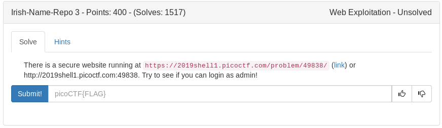
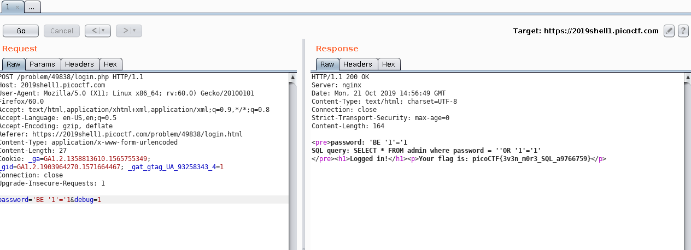

Attempt to login as admin and we see no username entry available. Loaded up burp and sent the login attempt to the repeater. Again we see the debug option so i turned that on and sent a simple 'OR '1'='1 sqli attempt which sent as 'BE '1'='1 hmmmm. Lets try BE instead of OR? Works and we get our flag

	
flag

