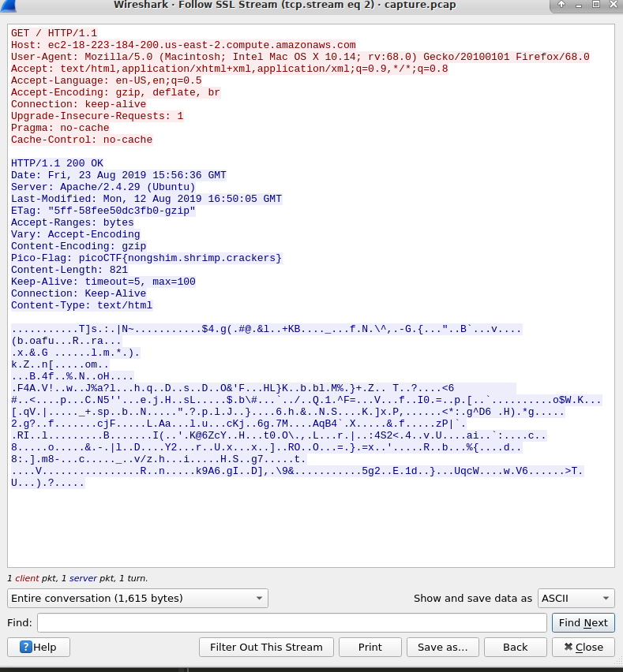

We are given 2 files:

```
capture.pcap: pcap capture file, microsecond ts (little-endian) - version 2.4 (Ethernet, capture length 65535)
picopico.key: ASCII text
```

With the hint we can assume we will need the key to decrypt the network traffic to plaintext. This website provides insight on what we need. [Source](https://support.citrix.com/article/CTX116557)

**wireshark capture.pcap**

edit -> preferences > Protocols > SSL > edit keys

create a new key with the following: (guessed on the source ip from a random packet in the pcap file)

128.237.140.23 - 443 - http - picopico.key

Now you should see some http packets turn green. Select follow screen and we get our plaintext traffic



Edit

<details>
	<summary>Flag</summary>

picoCTF{nongshim.shrimp.crackers}
</details>